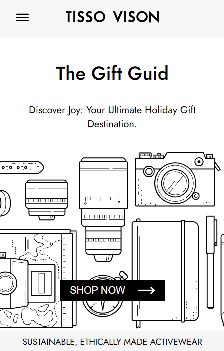
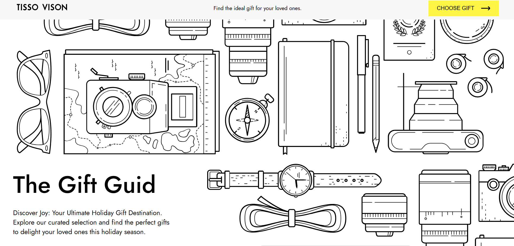
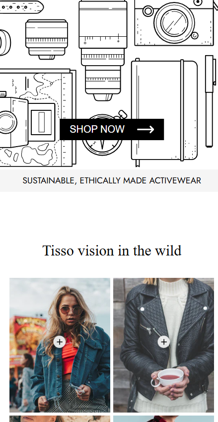
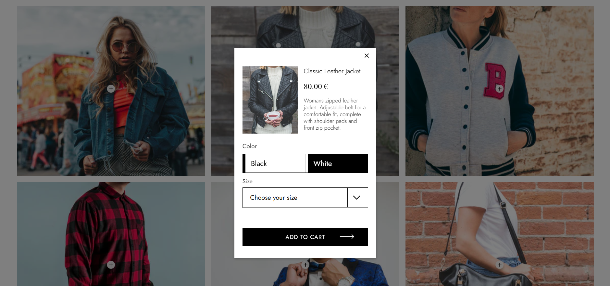
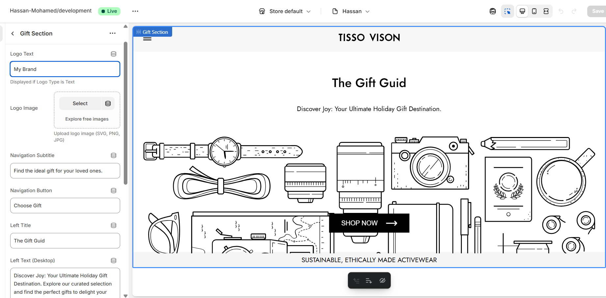

# Project Title
<span>
  🛍️ <strong> Advanced E-commerce Landing Page (Shopify)</strong>
</span>

A fully custom **Shopify landing page** designed with **Liquid, HTML, CSS, and JavaScript**.  
It includes multiple interactive sections with complete flexibility for store owners through Shopify's Theme Editor.  


## Features

### 🧭 Navigation Section
- **Brand logo** (text or image – editable in Shopify admin).  
- **Subtitle** with separate text for desktop and mobile views.  
- **Two CTA buttons** with slide animations and fully editable text.  

### 🖼️ Product Grid Section
- Displays products in a **clean grid layout**.  
- Each product includes a **hotspot plus button** (position controlled by X/Y coordinates via Shopify admin).  
- **Modal popup** when clicking the hotspot:
  - Select **product color**.  
  - Choose **size**.  
  - Add product directly to **Cart Drawer**.  


### 🛒 Cart Drawer
- Fully custom cart drawer design.  
- Smooth integration with **Add to Cart** button from product modal.  
- Displays selected product details dynamically
- Uses **Shopify AJAX API** to handle add-to-cart actions without page reload.  
- Fully integrated with **Shopify product variants** (color, size, etc.) for a dynamic shopping experience.  


### ⚙️ Layout & Schema
- Custom **layout** to unify the landing page design.  
- Rich **Shopify schema** so all elements are fully customizable by store owners:
  - Brand logo (image/text).  
  - Subtitles (desktop & mobile).  
  - CTA button labels, links, and animations.  
  - Hotspot button position (X/Y coordinates).  
  - Product images & details.  

## API Reference

#### Get all items
This project uses the [Shopify AJAX API](https://shopify.dev/docs/api/ajax) , to handle cart interactions (add, update, and retrieve cart data dynamically).


```http
  https://shopify.dev/docs/api/ajax
```


## Screenshots







